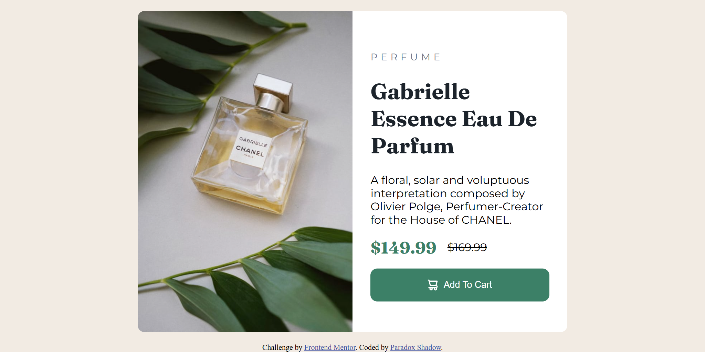
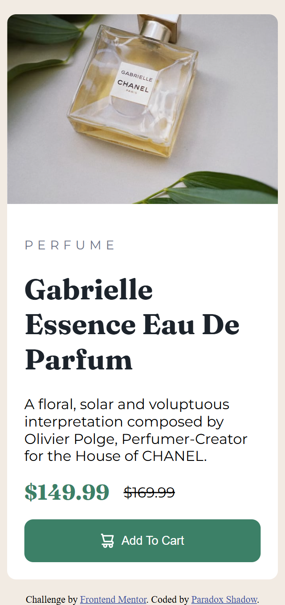

# Frontend Mentor - Product preview card component solution

This is a solution to the [Product preview card component challenge on Frontend Mentor](https://www.frontendmentor.io/challenges/product-preview-card-component-GO7UmttRfa). Frontend Mentor challenges help you improve your coding skills by building realistic projects. 

## Table of contents

- [Overview](#overview)
  - [The challenge](#the-challenge)
  - [Screenshot](#screenshot)
  - [Links](#links)
- [My process](#my-process)
  - [Built with](#built-with)
  - [What I learned](#what-i-learned)
  - [Continued development](#continued-development)
  - [Useful resources](#useful-resources)
- [Author](#author)
- [Acknowledgments](#acknowledgments)


## Overview

### The challenge

Users should be able to:

- View the optimal layout depending on their device's screen size
- See hover and focus states for interactive elements

### Screenshot





### Links

- Solution URL: [Add solution URL here]()
- Live Site URL: [Add live site URL here]()

## My process

### Built with

- Semantic HTML5 markup
- CSS custom properties
- Flexbox
- CSS Grid
- Mobile-first workflow


### What I learned
I was having a bit of a trouble in making the image span its entire container for the desktop design. The width was not an issue, but the height of the image was not covering the entire picture element, which must hve stretched due to the default nature of grid child elements that follow the align-items: stretch property. So, by making the picture element itself a flex container, I was able to make its child, which is the image element cover its entire height, again due to the very same property.

I also had to experiment a bit regarding the width of the main element which I have set up using the clamp property to make it responsive. I learned that the value that goes in the middle is the ideal value. If this value is greater than the highest value, then the highest value we have set up will be used and if it is lower than th lowest value than the width will become equal to the latter.

There was a bit of issue in the synchronization of the picture element and the media queries. If you will see in the picture element, I have set the mobile size picture for width upto 767px max and the desktop for width 768px min. However, the media queries for desktop design start from min-width: 767px. So, yeah there is a bit of mis-alignmenet of a pixel here, but this working for the best, so I went along with it.

```html
<picture>
      <source srcset="./images/image-product-mobile.jpg" media="(max-width: 767px)">
      <source srcset="./images/image-product-desktop.jpg" media="(min-width:768px)">
      
</picture>
```
```css
.product-card {
    max-width: clamp(19rem, 70%, 39rem);
}
```


### Continued development

Continue learning responsive design and media queries.


### Useful resources

- [Web.dev](https://web.dev/learn/design) - This helped me in learning about picture element, how to make images responsive and how to use clamp for setting responsive sizing.

## Author

- Website - [Paradox Shadow](https://github.com/Taresta/)
- Frontend Mentor - [Paradox](https://www.frontendmentor.io/profile/Taresta)

## Acknowledgments
Thanks to all the great resources out there and thank to my teacher.
